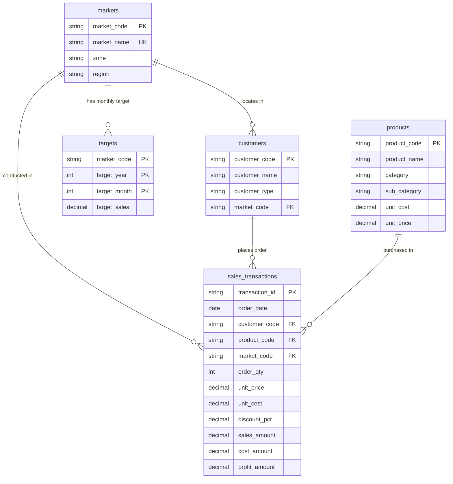

# Data Dictionary — Sales & Customer Performance Analytics

This data dictionary documents the database schema, entity structures, data types, primary/foreign key constraints, business descriptions, and sample values for the **`sales_analytics_db`** MySQL 8+ database.

---

## Entity Relationship Summary

---

## Table 1: `markets`
Stores geographical markets, zones, and regions where products are sold.

| Column Name | Data Type | Key / Constraint | Description | Sample Value | Business Meaning |
| :--- | :--- | :--- | :--- | :--- | :--- |
| `market_code` | `VARCHAR(20)` | **PK**, `NOT NULL` | Unique identifier for each market | `MKT_NA_E` | Standardized internal market code |
| `market_name` | `VARCHAR(100)` | `UNIQUE`, `NOT NULL` | Descriptive name of the market | `North America East` | Commercial market label |
| `zone` | `VARCHAR(50)` | `NOT NULL` | Global geographic zone | `North America` | Regional executive reporting zone |
| `region` | `VARCHAR(100)` | `NOT NULL` | Specific territory/state cluster | `US East` | Local sales manager territory |

---

## Table 2: `products`
Stores hardware and technology products, catalog hierarchy, and base pricing.

| Column Name | Data Type | Key / Constraint | Description | Sample Value | Business Meaning |
| :--- | :--- | :--- | :--- | :--- | :--- |
| `product_code` | `VARCHAR(20)` | **PK**, `NOT NULL` | Unique product identifier | `PROD_007` | Stock Keeping Unit (SKU) |
| `product_name` | `VARCHAR(150)` | `NOT NULL` | Commercial name of the product | `Developer Studio Laptop` | Catalog product name |
| `category` | `VARCHAR(100)` | `NOT NULL` | Top-level product category | `Laptops & Desktops` | Primary line of business |
| `sub_category` | `VARCHAR(100)` | `NOT NULL` | Sub-category grouping | `Laptops` | Tactical product taxonomy |
| `unit_cost` | `DECIMAL(10,2)` | `NOT NULL`, `>= 0` | Base cost to acquire/produce unit | `1600.00` | Cost of Goods Sold (COGS) base |
| `unit_price` | `DECIMAL(10,2)` | `NOT NULL`, `>= 0` | Standard list selling price | `2299.99` | Manufacturer Suggested Retail Price |

---

## Table 3: `customers`
Stores customer accounts, channel classification, and assigned market locations.

| Column Name | Data Type | Key / Constraint | Description | Sample Value | Business Meaning |
| :--- | :--- | :--- | :--- | :--- | :--- |
| `customer_code` | `VARCHAR(20)` | **PK**, `NOT NULL` | Unique customer account ID | `CUST_063` | Customer CRM ID |
| `customer_name` | `VARCHAR(150)` | `NOT NULL` | Name of the corporate client/store | `Vanguard Digital #63` | Customer account name |
| `customer_type` | `VARCHAR(50)` | `NOT NULL` | Channel/type of customer | `Corporate Reseller` | Channel partner classification |
| `market_code` | `VARCHAR(20)` | **FK**, `NOT NULL` | References `markets.market_code` | `MKT_NA_E` | Customer primary market location |

---

## Table 4: `targets`
Stores monthly sales revenue targets assigned to each market.

| Column Name | Data Type | Key / Constraint | Description | Sample Value | Business Meaning |
| :--- | :--- | :--- | :--- | :--- | :--- |
| `market_code` | `VARCHAR(20)` | **PK, FK**, `NOT NULL` | References `markets.market_code` | `MKT_NA_E` | Assigned target market |
| `target_year` | `INT` | **PK**, `NOT NULL` | Fiscal year for the target | `2024` | Budget year |
| `target_month` | `INT` | **PK**, `NOT NULL` | Calendar month (1–12) | `11` | Budget month |
| `target_sales` | `DECIMAL(12,2)` | `NOT NULL`, `>= 0` | Quota target revenue | `895000.00` | Target revenue quota |

---

## Table 5: `sales_transactions`
Fact table recording individual sales transaction records.

| Column Name | Data Type | Key / Constraint | Description | Sample Value | Business Meaning |
| :--- | :--- | :--- | :--- | :--- | :--- |
| `transaction_id` | `VARCHAR(30)` | **PK**, `NOT NULL` | Unique transaction ID | `TRX0045210` | Order / invoice number |
| `order_date` | `DATE` | `NOT NULL` | Transaction execution date | `2024-11-15` | Date of invoice issuance |
| `customer_code` | `VARCHAR(20)` | **FK**, `NOT NULL` | References `customers.customer_code` | `CUST_063` | Purchasing client |
| `product_code` | `VARCHAR(20)` | **FK**, `NOT NULL` | References `products.product_code` | `PROD_024` | Item purchased |
| `market_code` | `VARCHAR(20)` | **FK**, `NOT NULL` | References `markets.market_code` | `MKT_NA_E` | Point of sale market |
| `order_qty` | `INT` | `NOT NULL`, `> 0` | Quantity of units purchased | `5` | Line item quantity |
| `unit_price` | `DECIMAL(10,2)` | `NOT NULL`, `>= 0` | Selling price per unit | `3499.99` | Transaction unit price |
| `unit_cost` | `DECIMAL(10,2)` | `NOT NULL`, `>= 0` | Cost price per unit | `2200.00` | Transaction unit cost |
| `discount_pct` | `DECIMAL(4,2)` | `NOT NULL`, `0 to 1` | Percentage discount applied | `0.05` | Discount rate applied (5%) |
| `sales_amount` | `DECIMAL(12,2)` | `NOT NULL`, `>= 0` | Net revenue amount | `16624.95` | `order_qty * unit_price * (1 - discount_pct)` |
| `cost_amount` | `DECIMAL(12,2)` | `NOT NULL`, `>= 0` | Net Cost of Goods Sold | `11000.00` | `order_qty * unit_cost` |
| `profit_amount` | `DECIMAL(12,2)` | `NOT NULL` | Gross profit realized | `5624.95` | `sales_amount - cost_amount` |
